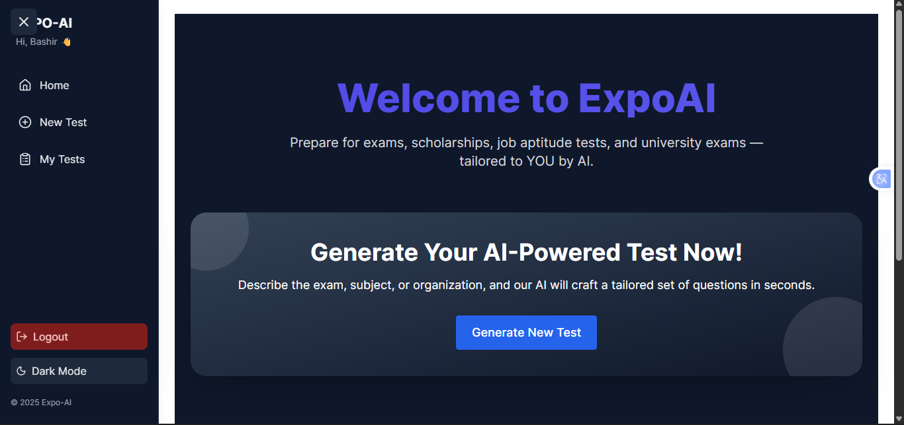
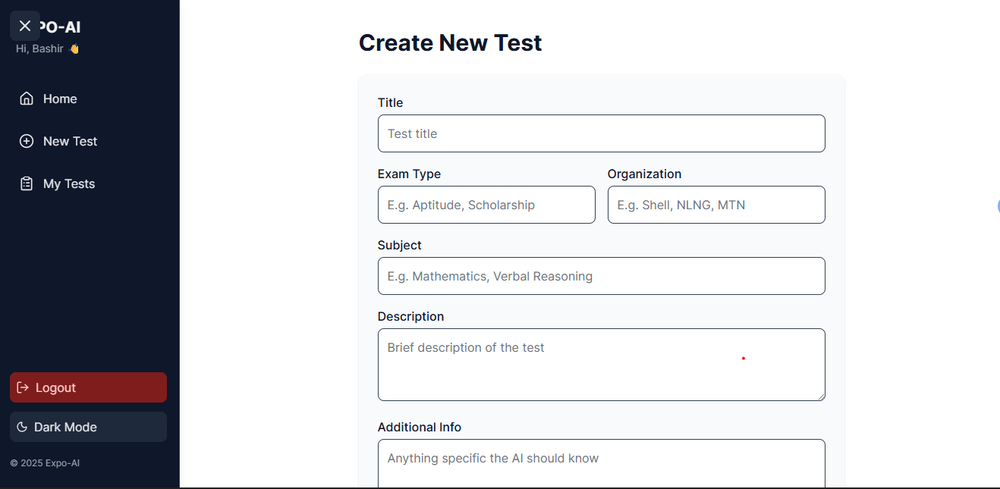

# EXPO-AI 🚀

**EXPO-AI** is an AI-powered exam preparation platform designed for students, job seekers, and scholarship candidates. It enables users to generate personalized practice tests tailored to specific exams, organizations, or aptitude requirements — all within seconds.

This project is currently an **MVP**, built for demonstration and presentation purposes, with a strong foundation for future expansion into full-scale student practice and analytics.

---

## 🌐 Live Application

* **Frontend (Vercel):** [https://expo-ai-tau.vercel.app/](https://expo-ai-tau.vercel.app/)
* **Backend API:** *(Private / configurable for deployment)*

> ⚠️ Note: The platform is presentation-ready. Some advanced features are still under active development.

---

## 🧠 Key Features

* AI-generated practice tests
* Organization & exam-specific questions
* Timed test runner
* Instant scoring and detailed explanations
* Previous test history
* Secure authentication with JWT
* Dark / Light mode support

---

## 🖥️ Tech Stack

### Frontend

* React (Vite)
* Tailwind CSS
* Axios
* React Router

### Backend

* Node.js
* Express.js
* MongoDB Atlas
* JWT Authentication

### Deployment

* Frontend: **Vercel**
* Backend: **Render / Railway (configurable)**

---

## 📸 Screenshots

> *(Screenshots will be added for the final demo)*

| Home Page                       | New Test Results                        |
| ------------------------------- | ----------------------------------- |
|  |  |

---

## 🎤 Pitch Deck

* **Presentation Slides:** [Link](https://gamma.app/docs/Expo-AI-Revolutionizing-Exam-Prep-kp8fwh4bs11tt1y?mode=present#card-q46boedw6qtv432)

---

## 🛠️ Local Development Setup

### Frontend

```bash
npm install
npm run dev
```

### Backend

```bash
npm install
npm start
```

---

## 👤 Author

**Abdurrahman Kabir**

* GitHub: [https://github.com/ABDURRAHMANKABEER](https://github.com/ABDURRAHMANKABEER)
* LinkedIn: [https://www.linkedin.com/in/abdurrahman-kabir-10580220b](https://www.linkedin.com/in/abdurrahman-kabir-10580220b)
* Email: [abdurrahmankabeer2003@gmail.com](mailto:abdurrahmankabeer2003@gmail.com)

---

## 📌 Project Status

🚧 **MVP – Presentation Ready**

Planned future enhancements include:

* Adaptive difficulty levels
* Performance analytics dashboard
* Student practice mode
* AI feedback and recommendations

---

*Expo-AI — preparing smarter, not harder.*